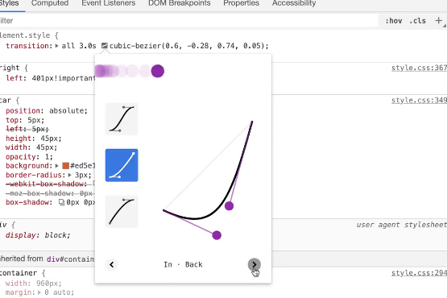

Easing is one of the most important things in motion design. It's the best way to breathe life and personality into an animation.

## Easing with CSS

```css
.element {
  /* eases available out of the box */
  animation-timing-function: linear/ease/ease-in/ease-out/ease-in-out;
  /* or for transitions*/
  transition-timing-function:

  /* The default, - you get this without defining anything */
  animation-timing-function: ease;

  /* Also the same as */
  animation-timing-function: cubic-bezier(0.25, 0.1, 0.25, 1);
}
```

With CSS, we're limited to two bezier handles for customisation of our easing curves.

[This site](https://cubic-bezier.com/#.17,.67,.83,.67) is a good place to play with easing.

You can also tweak easing right in chrome dev tools!



## Easing with GSAP

[GSAP ease visualizer](https://greensock.com/docs/v3/Eases)

Greensock uses SVG path syntax for easing curves so we get a lot more flexibility.
We can create more complex effects like bouncing, elastic eases, wiggles, or jerky eases.

Here are some GSAP eases with their corresponding CSS syntax

| GSAP                 | CSS                                    |
| -------------------- | -------------------------------------- |
| ease: "none"         | animation-timing-function: linear      |
| ease: "power1.inOut" | animation-timing-function: ease-in-out |
| ease: "power1.in"    | animation-timing-function: ease-in     |
| ease: "power1.Out"   | animation-timing-function: ease-out    |

## Bonus eases <!-- {docsify-ignore} -->

!> These eases aren't included in the core and need to be loaded in seperately with easepack or customease.
I've included these extra plugins in your pen.

### easePack

`SlowMo` [view docs](https://greensock.com/docs/v3/Eases/SlowMo)

`RoughEase` [view docs](https://greensock.com/docs/v3/Eases/RoughEase)

`ExpoScaleEase` [view docs](https://greensock.com/docs/v3/Eases/ExpoScaleEase)

```js
// register the plugin
gsap.registerPlugin(EasePack);

// example of a rough ease with a customised configuration
let roughEase =
  'rough({strength: 3, points: 50, template: strong.inOut, taper: both, randomize: false})';

gsap.to('#ufo', {
  duration: 2,
  y: -100,
  ease: roughEase,
});
```

### customEase

[view docs](https://greensock.com/customease)

```js
gsap.registerPlugin(CustomEase);

// example of a custom 'hopping' ease
CustomEase.create(
  'hop',
  'M0,0.005 C0,0.005 0.056,0.445 0.175,0.445 0.294,0.445 0.332,0 0.332,0 0.332,0 0.414,1 0.671,1 0.991,1 1,0 1,0'
);

gsap.to('#ufo', {
  duration: 2,
  y: -100,
  ease: 'hop',
});
```

## Exercise

Use the same pen and have a play around with different easing!

Try to think about the animation principles.

Can you show anticipation or mimic more realistic movement?
