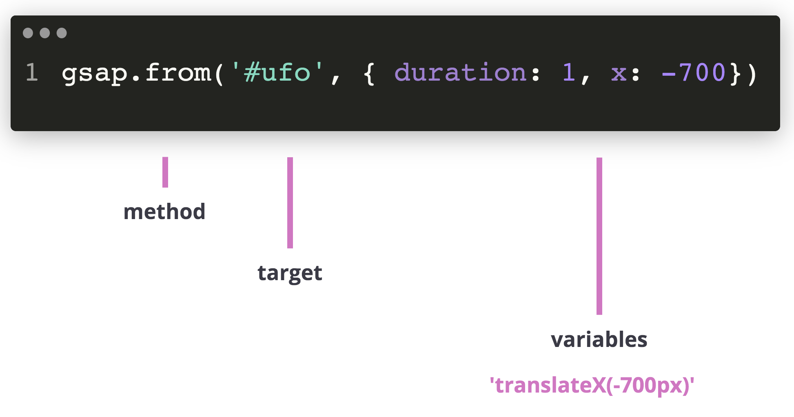

> A Tween does all the animation work - think of it like a high-performance property setter.

Animation on the web basically boils down to changing property values a lot of times per second. A greensock tween takes a starting value, an ending value and then interpolates between them 60 times per second.

The GSAP object has three methods for creating a tween.

A tween is made up of -

- **The method** -
  `gsap.from()`
  `gsap.to()`
  or `gsap.fromTo()`

- **The Target(s)** - the object(s) whose properties you want to animate. This can be selector text like `".class"`, `"#id"`, etc. Or it can be direct references to elements, generic objects, or even an array of objects
- **And lastly the variables** - an object containing all the properties/values you want to animate, along with any special properties like ease, duration, delay, or onComplete



## Properties:

Here's some common properties & animation commands along with their corresponding CSS syntax.

| GSAP                       | CSS                                 |
| -------------------------- | ----------------------------------- |
| duration: 1                | animation-duration: 1s              |
| repeat: -1                 | animation-iteration-count: infinite |
| repeat: 2                  | animation-iteration-count: 2        |
| delay: 2                   | animation-delay: 2                  |
| yoyo: true                 | animation-direction: alternate      |
|                            |                                     |
| fill: '#008080'            | fill: #008080                       |
| stroke: '#008080'          | stroke-color: #008080               |
| opacity: 0.5               | opacity: 0.5                        |
|                            |                                     |
| x: 100 (svg units)         | transform: translateX(100px)        |
| y: 100 (svg units)         | transform: translateY(100px)        |
| xPercent: 50               | transform: translateX(50%)          |
| yPercent: 50               | transform: translateY(50%)          |
|                            |                                     |
| scale: 2                   | transform: scale(2)                 |
| scaleX: 2                  | transform: scaleX(2)                |
| scaleY: 2                  | transform: scaleY(2)                |
|                            |                                     |
| rotate: 90                 | transform: rotate(90deg)            |
|                            |                                     |
| transformOrigin: '50% 50%' | transform-origin: 50% 50% - fill-box|
| svgOrigin: '100 200'       | transform-origin: 100 200 - view-box|


## Resources

[Tweens - GSAP docs](https://greensock.com/docs/v3/GSAP/Tween)

## Snippets

Use to and from whenever possible so that the start or end values are dynamically populated from their current values.

```js
// Animate to these values.
gsap.to('#ufo', { duration: 1, x: 450 });

// Animate from these values.
gsap.from('#ufo', { duration: 1, x: -450 });

// Not usually necessary.
gsap.fromTo('#ufo', { x: -450 }, { x: 450, duration: 2 });
```

### a more involved tween

```js
gsap.to('#ufo', { 
  duration: 1, 
  x: 450,
  transformOrigin: '50% 50%',
  repeat: -1,
  delay: 2,
  yoyo: true,
});
```

## Exercise

Time to add a tween to your SVG!

If you're using your own SVG, this [starter pen](https://codepen.io/svganimationworkshop/pen/WNxrRjX) has all the libraries you'll need included. Go ahead and fork it!

Alternately you can fork [this spaceship SVG](https://codepen.io/svganimationworkshop/pen/wvaerbO?editors=1010)